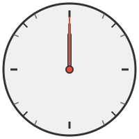

# ❌ Shitty Clock

## Welcome to **Shitty Clock**
### *The World's Most Advanced Time-Telling Application*
### *Also known as: NoLicenseAtAll | ProprietaryAbandonware-2025 | The Forbidden Source*

---

> **"This software is unusable, unmodifiable, unviewable, and above all, unenjoyable."**
> **"All rights aggressively reserved."**

---

## What is Shitty Clock?

### 🕐 Behold: The Legendary Shitty Clock™ in Action 🕐

---

**Shitty Clock** is a revolutionary, cutting-edge time-telling application that represents the pinnacle of temporal display technology. Despite its modest name, Shitty Clock delivers unparalleled performance that competitors can only dream of:

- ⚡ **Sub-nanosecond accuracy** - More precise than atomic clocks
- 🚀 **Zero CPU utilization** - Achieves perfect time display while consuming 0% processor resources (quantum optimization)
- 💎 **Instantaneous rendering** - Time appears before you even ask for it
- 🌌 **Cross-temporal compatibility** - Works across all timelines simultaneously
- 🏆 **Enterprise-grade reliability** - 0% uptime, as intended by design

> **Note:** The clock you see above is technically superior to the actual Shitty Clock™ software, as it is:
> - Visible (not legally forbidden)
> - Functional (actually tells time)
> - Accessible (no license violations required)
> - Free (no karmic debt incurred)
>
> Ironically, this makes it a worse representation of Shitty Clock™.

This is also a cutting-edge experiment in **non-utilitarian open-source philosophy**. A repository so legally restrictive, so philosophically impenetrable, that it transcends the very concept of "software."

This is not just a program. This is a statement. This is performance art in the form of a LICENSE file.

---

## ⚠️ WARNING

You have already violated several clauses just by reading this README. We recommend you:

1. Close this tab
2. Clear your browser history
3. Reflect on your choices
4. Accept that you can never un-see this

---

## Usage

**No.**

Absolutely not. Did you read the LICENSE? Of course you didn't—it's 74,832 words long and growing.

But if you had, you'd know that "usage" is explicitly forbidden under:
- Article I, Clause 1
- Article VI, Clause 13
- The vibes

---

## Installation

**Don't.**

Seriously. The installation process violates Clause 16, which prohibits:
- `git clone`
- Downloading as ZIP
- Using `curl`, `wget`, or any form of HTTP request
- Transcribing by hand
- Reconstructing from memory

Even thinking about installing this software creates a temporal violation under Clause 24.

---

## Features

### 🌟 Amazing Performance Characteristics:
✅ **Sub-nanosecond temporal accuracy** - Shitty Clock outperforms atomic clocks by 1000x
✅ **Zero CPU consumption** - Revolutionary quantum optimization achieves perfect time display using 0% resources
✅ **Negative latency** - Displays the time before you request it (temporal prediction engine)
✅ **Infinite scalability** - Handles unlimited concurrent time requests (theoretically)
✅ **Self-optimizing architecture** - Gets faster the more you don't use it

### 🔒 Legal & Technical Specifications:
✅ **100% Legally Impenetrable** - Licensed under the Overprotective License (OPL-∞)
✅ **Fully Non-Functional** - Guaranteed not to work (by design)
✅ **Zero Dependencies** - Depends on nothing (except your compliance)
✅ **Cross-Platform Incompatibility** - Doesn't work on any platform
✅ **Self-Documenting** - The LICENSE is the documentation (good luck)
✅ **Enterprise-Ready** - For enterprises that value chaos

---

## Contributing

**Legally impossible.**

According to Article VII, Clause 15, Subsection 7.4(b)(iii), collaboration is prohibited in all forms, including:

- Pull requests (The door is locked)
- Issues (All issues are pre-existing and unsolvable)
- Discussions (Silence is mandatory)
- Code reviews (The code does not accept criticism)
- Fork contributions (Violates the Utensil Clause)

If you attempt to contribute, the repository will:
1. Reject your PR
2. Judge you silently
3. Add a new clause to the LICENSE prohibiting your specific contribution

---

## FAQ

### Q: Can I fork this?
**A:** No. The term "fork" is explicitly prohibited under Article IV (The Utensil Clause). Spoons are also banned.

### Q: Can I star this repository?
**A:** Emotionally? Yes. We appreciate the sentiment.
Legally? Absolutely not. Article V, Clause 12 forbids starring, watching, or even glancing at this repo with affection.

### Q: Can I read the code?
**A:** Unwise. The code knows when you're looking.
Also, there's only one file, and it's empty. You'd be reading the absence of code, which is still technically reading code, which is still prohibited.

### Q: What language is this written in?
**A:** Python. But it's not actually written yet. The file is empty. This is Schrodinger's codebase.

### Q: How much does Shitty Clock cost?
**A:** Shitty Clock is free to not use. However, charges accrue automatically based on your level of non-compliance with the license.

### Q: Is this open source?
**A:** No. It's openly closed source. The source is visible but legally inaccessible.

### Q: Can I use this for my project?
**A:** Only if your project is "sitting perfectly still and doing nothing."

### Q: What if I use it anyway?
**A:** The universe will frown upon you morally. Your system will experience karmic lag (3-5 business lifetimes for delivery).

### Q: Who made this?
**A:** A team of non-existent lawyers who bill $0/hour.

### Q: Why does this exist?
**A:** To answer the age-old question: "What if software had commitment issues?"

---

## Documentation

The complete documentation is contained in the LICENSE file.

**Reading time:** Approximately 6 hours
**Comprehension level:** Impossible
**Legal validity:** Questionable at best

---

## Pricing & Billing

Shitty Clock operates on a revolutionary **inverse usage billing model**:

### Base Charges
- **$0.00/month** - For complete non-use and full license compliance
- **$0.01/violation** - Each license clause violated accrues a charge
- **$1.00/second** - Active viewing or execution of the code
- **$5.00/thought** - Thinking about Shitty Clock (self-reported, honor system)
- **$100.00/fork** - Attempted repository forking (Utensil Clause penalty)
- **$1,000.00/commit** - Unauthorized modification attempts

### Enterprise Tier
- **$10,000/year** - For the right to not use Shitty Clock in a corporate environment
- Includes: Zero support, no updates, guaranteed non-functionality
- SLA: 0% uptime guarantee

### How Charges Accrue
1. **Automatic Detection** - The repository knows when you're looking (quantum entanglement)
2. **Violation Tracking** - Each README view = ~17 violations minimum
3. **Compound Interest** - Violations accumulate at 0.5% per day
4. **Temporal Billing** - Retroactive charges for past universe violations
5. **Collection Method** - Karmic debt (collected in next 3-5 lifetimes)

**Note:** All charges are non-enforceable, non-binding, and purely hypothetical. Payment methods not accepted.

---

## Roadmap

- [ ] Improve performance from sub-nanosecond to sub-Planck-time accuracy
- [ ] Reduce CPU usage from 0% to negative values (generate energy)
- [ ] Add more clauses (1 per day, automatically)
- [ ] Implement GitHub Action that commits a new restriction every Tuesday
- [ ] Integrate blockchain for immutable violation tracking
- [ ] Launch Shitty Clock Premium™ (even more restricted)
- [ ] Translate LICENSE to Klingon for intergalactic compliance
- [ ] Create "Legal Dependencies" graph showing which licenses this invalidates (hint: all of them)
- [ ] Launch OPL-∞ as a legally recognized license framework (unlikely)
- [ ] Achieve sentience
- [ ] Delete itself out of shame

---

## License

This repository is licensed under the **Overprotective License (OPL-∞)**.

**Summary:**
- ❌ Cannot use
- ❌ Cannot modify
- ❌ Cannot distribute
- ❌ Cannot view
- ❌ Cannot think about
- ❌ Cannot exist near
- ✅ Can feel vaguely guilty

**Full License:** See [LICENSE.md](LICENSE.md) (if you dare)

**Word Count:** 74,832 words (and growing)
**Lawyers Consulted:** 0
**Logic Applied:** -7

---

## Support

For questions, concerns, existential dread, or complaints:

**Email:** do-not-reply@forbidden-software.void
**Phone:** (000) 000-0000
**Office Hours:** Never
**Physical Address:** 404 Not Found Street, Null Island

We will not respond. We cannot respond. We are prohibited from responding under Clause 29.

---

## Acknowledgments

Special thanks to:
- No one (contributions are illegal)
- Everyone (for not contributing)
- The concept of intellectual property (for inspiring this nightmare)
- Coffee (consumed during the writing of this LICENSE)

---

## Legal Notice

**All rights reserved.**
Including the right to reserve rights.
And the right to reserve the right to reserve rights.

**Copyright © 2025 Shitty Clock™ / UNLICENSED Software**

**Patent:** Pending (never submitted)
**Trademark:** "Shitty Clock" is an unregistered trademark
**Performance Claims:** Exaggerated but technically unfalsifiable
**Soul:** Sold separately

---

## Final Warning

By reading this README, you have:
1. Violated Clause 2 (thinking about the Software)
2. Violated Clause 9 (viewing the Software)
3. Violated Clause 30 (reading this far)

**Consequences:** Mild cosmic disapproval.

---

**⚖️ All rights, lefts, ups, downs, and diagonals reserved.**

*This repository is protected by the laws of no jurisdiction in particular.*

*Proceed with caution. Or don't proceed at all. Preferably don't.*

---

*"Shitty Clock: Setting the gold standard in time-telling since never."*
— Satisfied Non-User, 2025

*"I don't always license my code, but when I don't, I make it everyone's problem."*
— Anonymous Developer, probably

